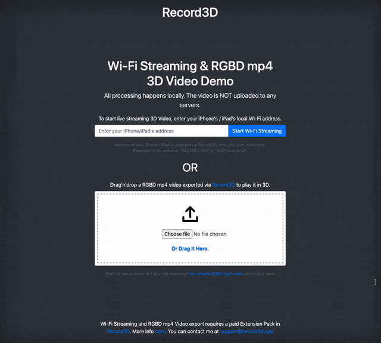

# [Record3D](https://record3d.app)'s Wi-Fi Streaming & RGBD mp4 3D Video Demo

*New feature (2021-03-07): Added an AR demo (`ar.html`), which you can try at [https://record3d.app/ar](https://record3d.app/ar). You will need to point your camera at the [Hiro marker](https://stemkoski.github.io/AR-Examples/markers/hiro.png) to see the 3D Video in AR.* 

This is a demo project for the [Record3D](https://record3d.app) iOS app. You can test the demo at this address: [http://record3d.xyz](http://record3d.xyz).

To preview the demo, use Safari or Google Chrome, **it does not work in Firefox**. Due to security restrictions, the demo must be run on a `http://` website (i.e. not on `https://`). You can also try the demo by downloading this repository and opening the `index.html` file in your browser.

This demo will allow you to:
 
- Replay your exported RGBD mp4 Videos, which are very small compared to the native 3D Videos (at the cost of added noise).
- Live-stream 3D Videos into your browser on your local Wi-Fi network (i.e. NOT over the Internet).

To use Wi-Fi Streaming and RGBD Video export, you will need to purchase the Wi-Fi Streaming & RGBD Videos Extension Pack.

*See also [this simple streaming demo project](https://github.com/marek-simonik/record3d-simple-wifi-streaming-demo) for more details.*

Here you can see how to replay exported RGBD mp4 files in 3D:

# How to contribute

- `git clone git@github.com:marek-simonik/record3d-wifi-streaming-and-rgbd-mp4-3d-video-demo.git`
- `npx serve` or `npx ssl-serve --ssl` if https is needed
